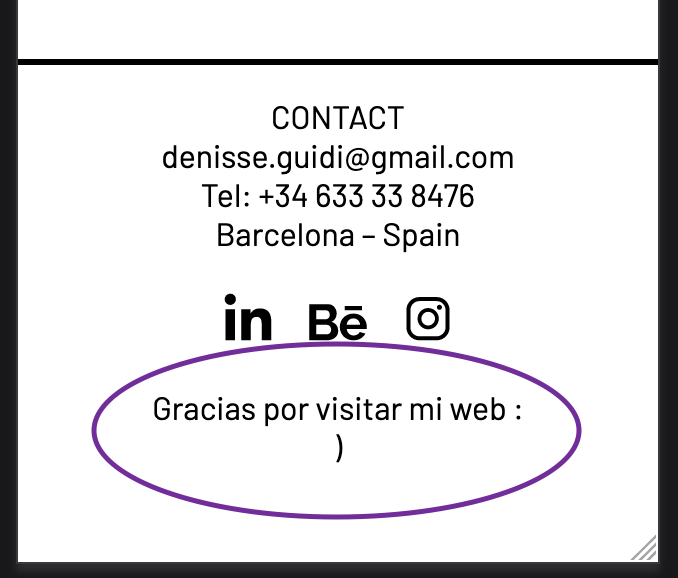
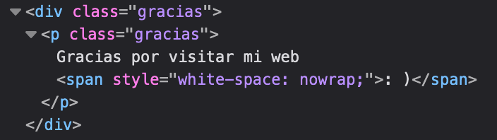
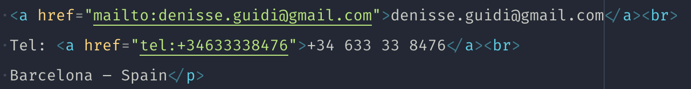
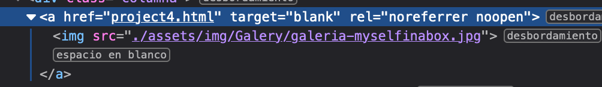
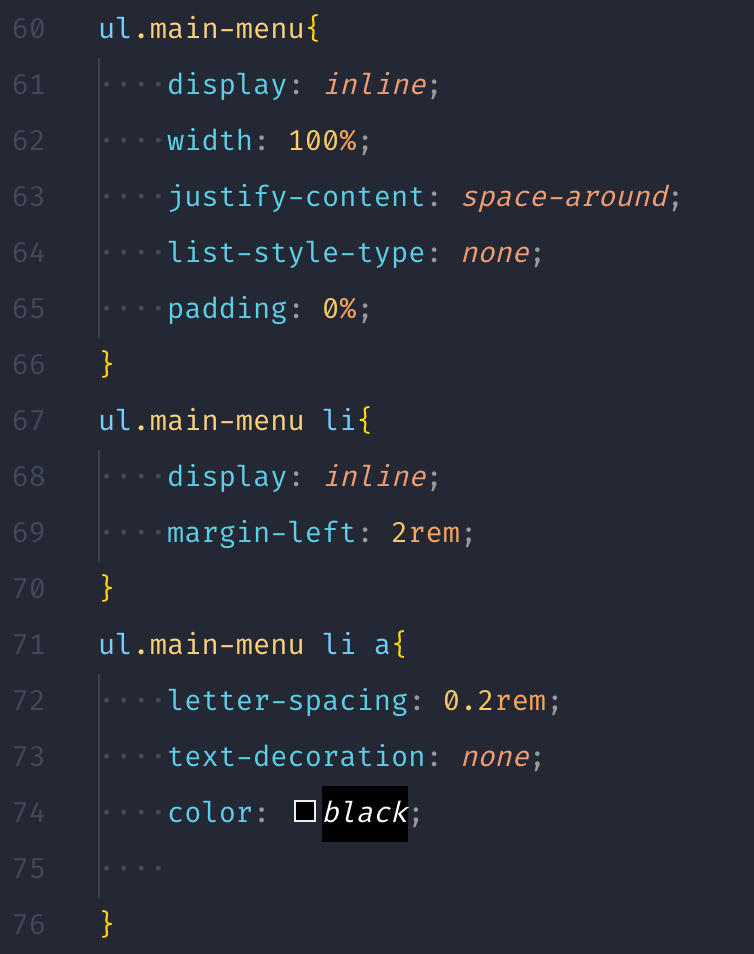
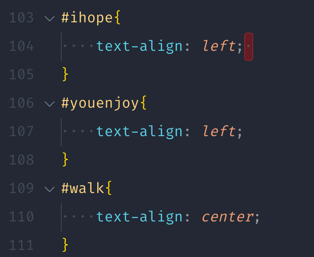
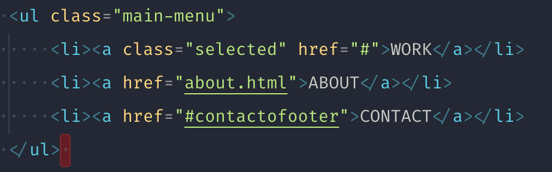
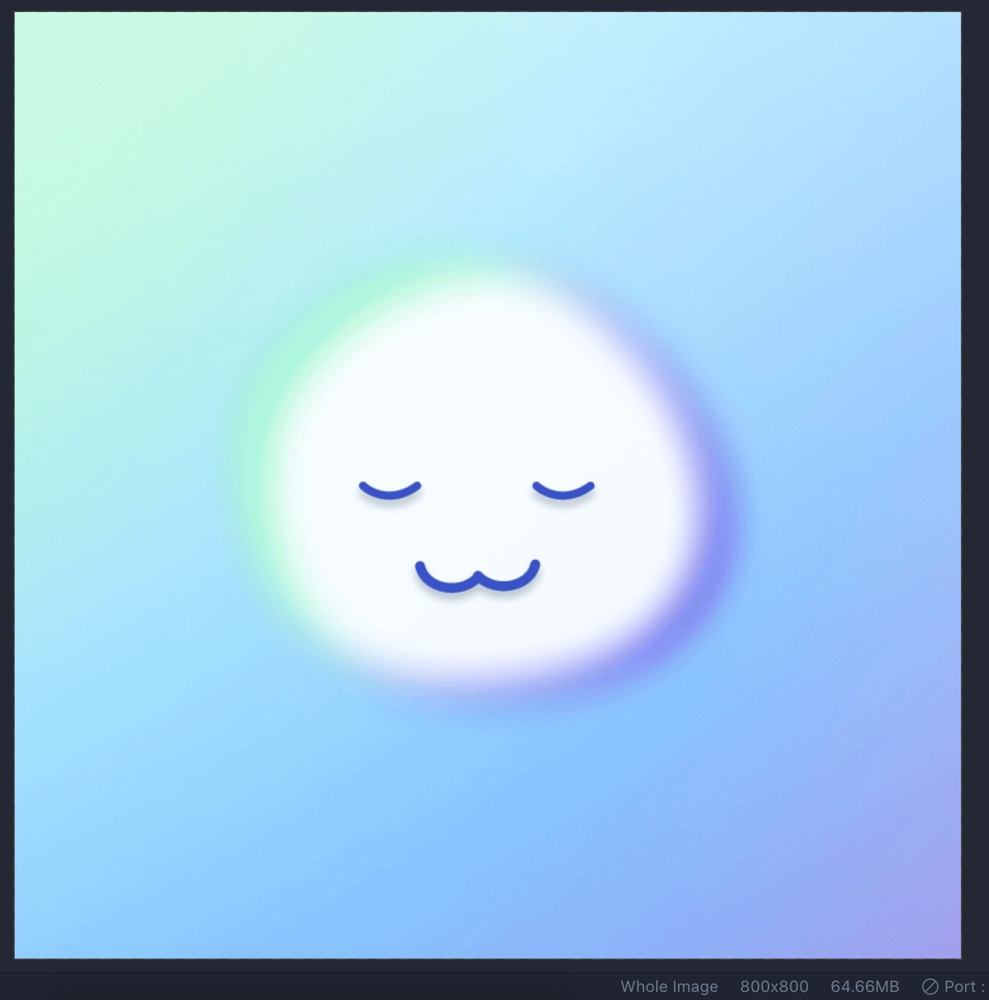

# Review final

Por lo general lo veo todo muy bien, muy organizado y bien resuelto. Muy buen trabajo!!!
Te paso algunas cosas que he ido viendo y otras que son para hilar mucho más fino.

En dispositivos pequeños la carita se parte y no se entiende. Te propongo una solución en la siguiente imagen. Esto mejor si lo añades como clase en lugar de style inline:

Aprovechando que estamos en esta sección, podríamos mejorar la parte del footer añadiendo links a tu email y teléfono de contacto, si no quieres que se vean como links, los puedes estilar quitándole todas las características de un link, o estilarlos diferente

Y tienes un pequeño error con los links externos, el valor de `rel` es `noreferrer noopener`

Ten cuidado con anidar muchos elementos, esto generan mucha [especificidad en los estilos](https://developer.mozilla.org/es/docs/Web/CSS/Specificity) y se vuelve más difícil de mantener en un futuro. De preferencia utiliza una clase y estilala direntamente

Y de preferencia también utiliza clases en lugar de ids

Cuando añadas texto que prefieras que esté en mayúsculas, de preferencia por accesibilidad, utiliza minúsculas y estílalas con la propiedad `text-transform` de CSS. Ya que los screen readers suelen deletrear las mayúsculas.

Y en esta misma sección, tienes un pequeño error cuando en móvil haces click en Contacto, no se te cierra el menú, y esto lo tienes que controlar con Javascript. De hecho, puedes aprovechar la función que tienes hecha y añadirle la clase `js-burger-is-open` al link de contacto

En cuanto a las imágenes, ten en cuenta el tamaño, pesan bastante y harán más lenta tu página. En principio no deberían pesar más de 300/400 KB (las imágenes grandes) o por lo menos, menos de 1MB (si son muy grandes). Actualmente tienes varias imágenes de varios megas, tienes [algunas opciones online](https://tinypng.com/) para optimizarlas.

Y para terminar, yo arreglaría lo del uso de carpetas con archivos `index.html` dentro de ellas, tendrías urls mucho más amigables. E intenta añadir el reset inicial en el CSS, para que tengas menos problemas con los navegadores.
